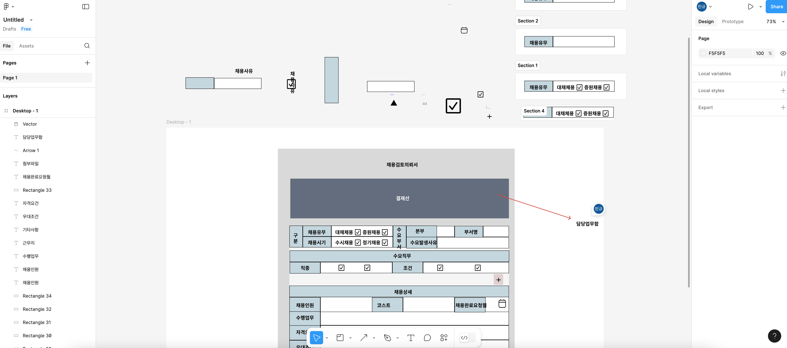

# 피그마 기본 사용법

피그마는 화면 디자인을 위해 적절한 툴을 찾다가 선택을 했습니다.

## 기본사용법

1. 왼쪽의 레이아웃
2. 중앙 하단의 툴바
3. 우측의 디자인 상세 설정

으로 나누어져 있습니다. 

저는 주로 자주 사용하는 엘리먼트들을 섹션으로 묶어서 프레임 바깥에 놔두고 관리합니다.

ppt랑은 다르게 ctrl c + v를 하면 엘리먼트가 바로 그 자리에 생깁니다. 그래서 마우스 오른쪽 버튼을 눌러 'paste here'로 원하는 위치에 복사할 수도 있고 그냥 붙여넣기 한 후 왼쪽 레이아웃에서 엘리먼트를 선택할 수도 있습니다. 

 중앙의 툴바에서 텍스트를 클릭하고 원하는 위치에 클릭하면 텍스를 입력할 수 있고 텍스트 엘리먼트를 클릭하고 단축키 t를 누르면 바로 텍스트를 편집할 수도 있습니다.

우측에서 상세 디자인 설정을 할 수 있습니다.

가볍게 ppt대신 피그마로 화면설계를 해보았습니다.

